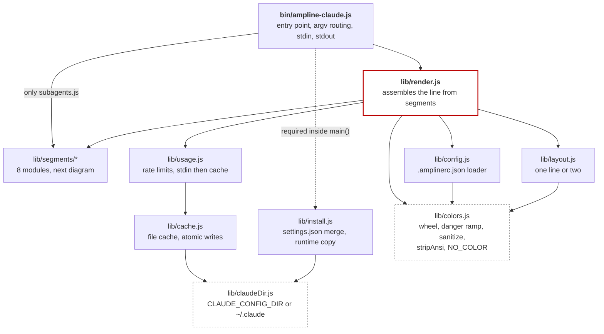
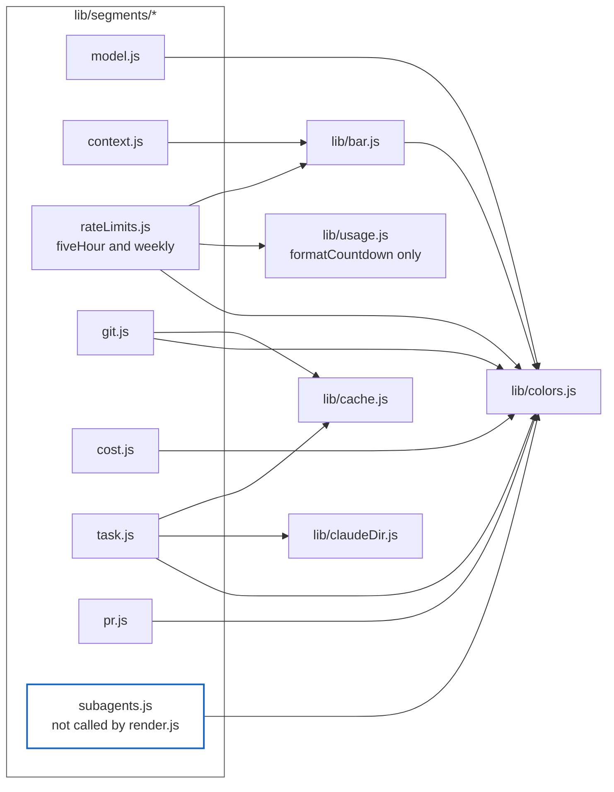

# C4 Level 2: Containers

The internal pieces of the package and how they depend on each other. "Container" is meant
loosely here. ampline-claude is one Node program with no separately running units, so this
diagram shows its modules and the `require()` edges between them. Every edge was read from the
source, not inferred from the layout in [`../CLAUDE.md`](../CLAUDE.md).

> Drawn as a flowchart, not Mermaid's native `C4Container` type. That renderer is still
> experimental and inconsistent on GitHub. The modules are split across two diagrams to keep
> each one readable.

## Core: entry point, render pipeline, and shared libraries

## Segments and what each one needs

## Reading the diagrams

**`colors.js` has no imports and nearly everything imports it.** It is the leaf of the graph. That
is why its interface is frozen in [`../CLAUDE.md`](../CLAUDE.md). A signature change there reaches
every segment, the layout, the config loader, and the bar renderer.

**No segment requires another segment, and none requires `render.js`.** `render.js` calls each
one with a single `ctx` object holding `input`, `config`, and `usage`, so a segment cannot
reach for something it was not handed. The one apparent exception is `rateLimits.js` importing
`formatCountdown` from `usage.js`. It reads the resolved usage from `ctx.usage` and only borrows
a formatting helper.

**Four segments need nothing but the payload.** `model`, `cost`, and `pr` use only `colors.js`.
`context` uses only `bar.js`. These never touch the disk, so they cannot be slowed by it.

**Only `git.js` and `task.js` talk to the cache directly.** `usage.js` is the third cache user,
through `cache.js` on the main diagram. `git.js` also spawns the one `git` subprocess. `task.js`
reads the todo files under the Claude config directory. See [`cache-tiers.md`](cache-tiers.md).

**`dir` is not a file.** The `dir` segment is a small function inside `render.js`
(`renderDirSegment`), listed in the same `RENDERERS` table as the files above. It shows the repo
name from the payload, else the working directory's basename, sanitized.

**The subagent path skips most of the graph.** `bin/ampline-claude.js` calls
`renderSubagentLine` directly. That path never calls `config.js`, `usage.js`, `layout.js`, or the
cache, and takes its width from the payload's `columns` field. See
[`overview.md`](overview.md).

**`install.js` is required inside `main()`, not at the top of the file.** It is loaded after the
`--help` and `--version` checks and before the installer, subagent, and render branches are chosen,
so it is in memory on every real invocation. It depends only on `claudeDir.js` and Node
built-ins. It repeats the cache directory path as its own constant instead of importing
`cache.js`. See [`install-flow.md`](install-flow.md).

When you add a segment or a module, update both diagrams and the module layout in
[`../CLAUDE.md`](../CLAUDE.md).

---
_Last updated: 2026-10-07 · reflects v0.6.0_
