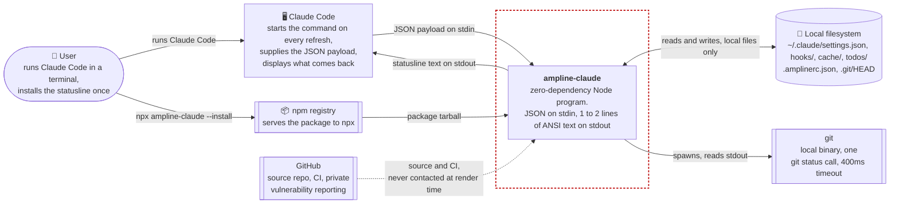

# C4 Level 1: System context

Where ampline-claude sits relative to the people and systems around it. It is a local program
with no server, no account, and no network access of its own. Everything it knows arrives on
stdin from Claude Code or is read from the local disk.

> Drawn as a flowchart, not Mermaid's native `C4Context` type. That renderer is still
> experimental and inconsistent on GitHub. This follows standard C4 Level 1 conventions
> (person, system boundary, external systems) without relying on it.

## What it does not do

This is the part of the context that matters most, and each line is a rule in
[`../CLAUDE.md`](../CLAUDE.md) and [`../SECURITY.md`](../SECURITY.md), not a habit.

| Absent by design | What is true instead |
| --- | --- |
| No network call | No HTTP, socket, or DNS code exists in `bin/` or `lib/`. Rate-limit data comes only from the `rate_limits` field Claude Code sends, cached to disk. An OAuth fallback was considered and rejected (see the README FAQ) |
| No credential read | It reads no token, key, or login file. The installer does parse `settings.json`, which can hold unrelated secrets, but only to merge two keys and write it back with its original permissions |
| No call to `gh` or `glab` | The `pr` segment only reads `pr` from the payload. Claude Code populates that field, using `gh` or `glab` on its side |
| No writes outside the Claude config directory | Settings, backups, the installed runtime, and the cache all live under `~/.claude` or the `CLAUDE_CONFIG_DIR` override |
| No runtime dependencies | `package.json` has no `dependencies` field, so `npx` fetches only this package |

## Reading the diagram

**Claude Code is both the input and the output.** It is the only thing that sends data in and
the only thing that reads the result. The program has no other interface while it renders.

**The filesystem is a side channel, not a data source of record.** The payload is authoritative.
The disk holds the cache, the todo files Claude Code writes, the repo's `.git/HEAD`, and the
optional `.amplinerc.json` config. Of these, the repo's own files and the config are content
the user did not necessarily write, which is why foreign strings are sanitized before they
reach stdout. See [`deployment-security.md`](deployment-security.md).

**npm and GitHub only matter at install and release time.** Neither is contacted while the
statusline renders. CI runs on GitHub, but publishing is a manual `npm publish` from the
maintainer's machine, so the dotted edge from GitHub shows where the source and checks live, not a
deploy. The release path is in [`deployment-security.md`](deployment-security.md).

**git is a local subprocess, not a service.** The branch name comes from reading `.git/HEAD`
directly. The one subprocess call supplies ahead, behind, and dirty state, and its result is
cached. See [`cache-tiers.md`](cache-tiers.md).

For the pieces inside the box, see [`c4-container.md`](c4-container.md). For the one-picture
version of the whole flow, see [`overview.md`](overview.md).

---
_Last updated: 2026-10-07 · reflects v0.6.0_
