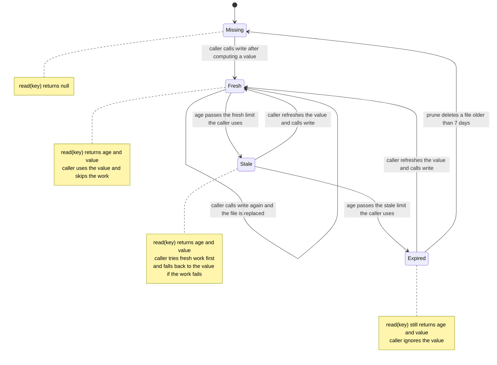
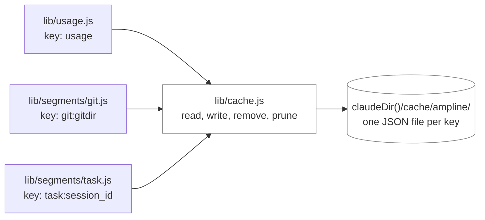
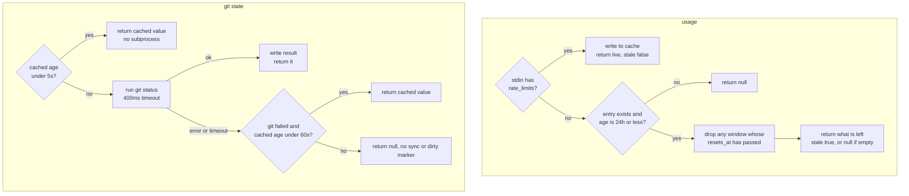
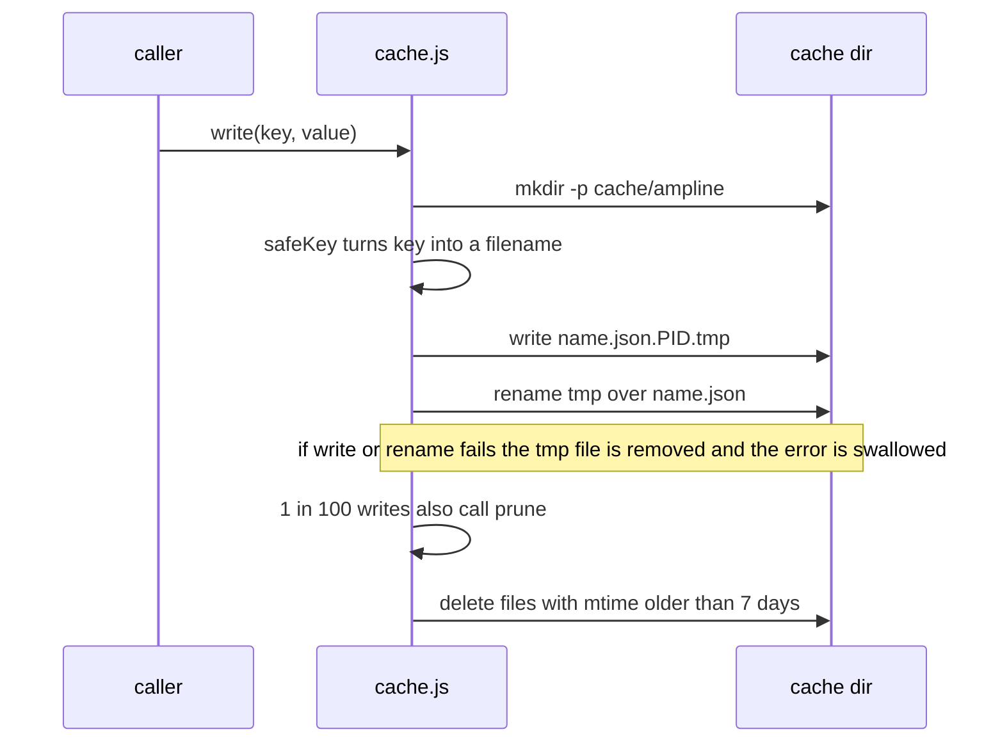

# State diagram: the two-tier disk cache

How one cache entry in `lib/cache.js` moves from missing to fresh to stale to expired, and which
callers decide what each age means. Three modules use the cache: usage, git state and the current
task. For where the cache sits in a render, see [`render-sequence.md`](render-sequence.md). For the
module map, see [`overview.md`](overview.md).

**`cache.js` has no idea what fresh or stale means.** `read(key)` stats the file, parses it, and
returns `{ age, value }`, where `age` is `Date.now()` minus the file's mtime, clamped to zero or
more. A missing file, an unreadable file, or content that is not valid JSON all return `null`.
The fresh and stale limits live in each caller, as in the table below, so the Fresh, Stale and
Expired states are a convention the callers share, not a field in the file. An entry never
expires on its own. It stays on disk until something overwrites it or `prune()` deletes it.

**Why the split is in the caller:** the three consumers need different rules. Usage has no fresh
window at all, git wants to avoid a subprocess, and the task cache only saves some directory
reads. A single TTL in `cache.js` would have been wrong for at least two of them.

## Who uses the cache

| Consumer | Key | Fresh | Stale | What a miss costs | Source |
|---|---|---|---|---|---|
| Usage | `usage` | none, write-through | 24h, plus a `resets_at` rollover check | nothing to show until the next payload carries `rate_limits` | `lib/usage.js` |
| Git state | `git:<gitdir>` | 5s | 60s | one `git status --porcelain=v2` subprocess, 400ms timeout | `lib/segments/git.js` |
| Current task | `task:<session_id>` | 3s | 15s | one directory listing plus one file read in `~/.claude/todos/` | `lib/segments/task.js` |

The constants in the code match the "Cache TTLs" table in [`../CLAUDE.md`](../CLAUDE.md):
`MAX_STALE_MS` is 24 hours in `usage.js`, `GIT_FRESH_MS` and `GIT_STALE_MS` are 5000 and 60000 in
`git.js`, and `FRESH_MS` and `STALE_MS` are 3000 and 15000 in `task.js`. No other segment reads
or writes the cache. The branch name itself is never cached, because `git.js` reads it straight
from `.git/HEAD` on every render.

## Usage, git and task each use the tiers differently

**Usage is write-through, not read-through.** When the payload carries `rate_limits`, the value
is written to the cache on every render and returned as live, so the cache never decides anything
while stdin is present. It only matters on a render where the payload lacks `rate_limits`, such
as a cold start before the first API response. In that case the entry is used only if it is
24 hours old or less, each window is dropped once its own `resets_at` has passed (its percentage
describes a window that has rolled over, so it is wrong and not merely old), and whatever is left
is returned with `stale: true`. The rendering of that stale flag is covered in `DECISIONS.md` D11.

**Git has all three tiers.** Under 5 seconds it returns the cached ahead, behind and dirty state
and runs nothing. Past that it runs the one `git status` call and overwrites the entry. If the call
fails or times out, an entry up to 60 seconds old is still used, and anything older yields `null`,
so the branch renders without the sync arrows and the dirty marker. A successful call always
rewrites the entry, so a repo that keeps rendering stays in the Fresh state. See `DECISIONS.md`
D20 for why this is the only subprocess.

**Task has a fresh tier and a nominal stale tier.** Under 3 seconds the cached string is returned,
and an empty string means "no in-progress todo" and renders nothing. Past that, `readTask()`
scans `todos/` and the result, including an empty one, is written back. The 15 second stale
fallback runs only if the refresh throws, and `readTask()` catches its own filesystem errors and
returns an empty string, so that path is rarely reached in practice.

## Writes, key names and pruning

**Atomic writes.** The main statusline and the subagent statusline are separate processes that
can write the same key at the same moment. Each writer puts its JSON in a file named for its own
process id, then renames it over the real file. A concurrent reader sees either the old complete
file or the new complete file, never a half-written one. A failed write is dropped silently, which
fits the degradation contract in [`../CLAUDE.md`](../CLAUDE.md): a missing cache entry just means
the caller does the work again.

**Windows filenames.** Keys like `task:<id>` and `git:<path>` contain characters Windows will not
accept in a filename, and `:` is NTFS alternate data stream syntax, so such a name does not round
trip. `safeKey()` replaces every character outside `[A-Za-z0-9_-]` with `_`. If the result is
longer than 64 characters, it keeps the first 47 characters and appends a dash and 16 hex digits
of the SHA-1 of the original key, so a long repo path still maps to a stable 64 character name.

**`prune()`** walks the cache directory and deletes every file whose mtime is more than 7 days
old, which also sweeps up any `.tmp` file left behind by a crash. Nothing else deletes per-session
and per-repo files, because every new session and every new repo adds a key. It runs from inside
`write()` on a 1% dice roll, not on a schedule, so normal renders pay nothing for it. `remove(key)`
exists in the module but has no callers in `lib/` or `bin/` today. Uninstall removes the whole
cache directory instead, see [`install-flow.md`](install-flow.md).

**The directory** is `claudeDir()` plus `cache/ampline`, so it follows `CLAUDE_CONFIG_DIR`. It is
resolved once when the module loads.

## Known gap

The "never a hang" guarantee has a real timeout only on the single `execFileSync('git', ...)` call.
The synchronous reads in `cache.js` (`statSync`, `readFileSync`, `readdirSync` in `prune`) and in
`segments/task.js` (`readdirSync`, `statSync`, `readFileSync`) have no ceiling. On a network
mounted `~/.claude`, a render can block for as long as that I/O takes. Fixing it means moving
those paths off synchronous I/O, which conflicts with `resolveUsage` and `renderStatusline` being
deliberately synchronous. [`../CLAUDE.md`](../CLAUDE.md) flags this and it is not addressed yet.
See also [`deployment-security.md`](deployment-security.md).

---
_Last updated: 2026-10-07 · reflects v0.6.0_
