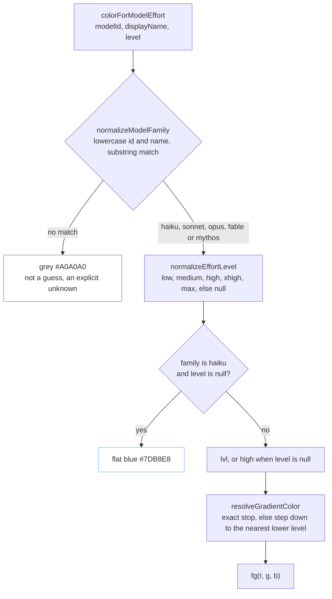
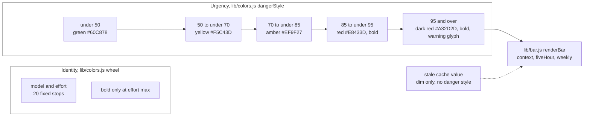

# Flowchart: how a model and effort become a color

How `colorForModelEffort` in `lib/colors.js` turns a model id, a display name and an effort level
into one truecolor escape. The model segment and the subagent rows both call it. An unrecognized
family gets a neutral grey instead of a guessed color. Under `NO_COLOR`, `fg()` returns an empty
string, so every path below produces no escape at all.

**Family matching is substring based.** The check order is `haiku`, `sonnet`, `opus`, then
`fable` or `mythos`. Both the id and the display name are searched because the display name
format is not guaranteed.

**Effort never defaults inside `normalizeEffortLevel`.** Anything that is not one of the five
known levels returns `null`. That covers an absent field, a numeric token budget from the subagent
payload and an unknown string. The fallback to `high` happens one step later, in
`colorForModelEffort`, and Haiku is the one family that skips it. A Haiku with no effort data
(Haiku 4.5 has no effort parameter) keeps the flat `#7DB8E8` it always had. A Haiku with effort
(Haiku 5.5) uses its own five-stop blue ramp. `resolveGradientColor` steps down to a lower defined
level if a family ever lacks one, and the code notes this may never fire in practice.

## The 20 stops

| Family | low | medium | high | xhigh | max |
|---|---|---|---|---|---|
| Haiku | `#3D64E8` | `#4D79E8` | `#5D8EE8` | `#6DA3E8` | `#7DB8E8` |
| Sonnet | `#5CE8D0` | `#4AC98C` | `#7ACC3D` | `#C4CC3D` | `#E8B23D` |
| Opus | `#E8963D` | `#E8763D` | `#E85A3D` | `#E8433D` | `#D8203D` |
| Fable | `#E88CC8` | `#E85CB3` | `#C43DE8` | `#B300D8` | `#8000C0` |

Each hex was converted from the RGB triples in `MODEL_GRADIENTS`. For example Haiku low is
`61,100,232`, which is `#3D64E8`, and Fable max is `128,0,192`, which is `#8000C0`. Read left to
right and top to bottom, the sweep goes blue, cyan, green, yellow, orange, red, pink, violet,
purple. The `WHEEL` export is these same 20 triples in that order and is used by the tests, not at
render time.

## Why this is a separate scale from usage bars

**Color means identity on the left and bold means urgency on the right.** The wheel carries no
urgency signal. A red Opus is not a warning, it is just Opus. The only bold on the wheel is effort
`max`, and only the effort word is bolded, not the model name. The danger ramp is the opposite:
the colors are a green to red climb, and bold starts at 85 percent. A non-finite percentage
makes `renderBar` return `null` before `dangerStyle` is ever called, so the segment is omitted. A stale
cached value renders dim with no danger color, bold or glyph, because urgency from a possibly
outdated number is worse than none.

**Why the two scales are not blended:** Opus xhigh is `#E8433D` and a usage bar at 85 percent is
`#E8433D` too, so the same pixels mean different things in different segments. Keeping bold as the
only urgency cue on the usage side, and nearly absent on the model side, is what keeps them
readable together. D37 in [`../DECISIONS.md`](../DECISIONS.md) records the Haiku ramp, the measured
spacing between stops, and the rule that `max` stays the only bold level. The rules are also
stated in [`../CLAUDE.md`](../CLAUDE.md). For where the model segment sits in a render see
[`render-sequence.md`](render-sequence.md), and for the module map see [`overview.md`](overview.md).

---
_Last updated: 2026-10-07 · reflects v0.6.0_
