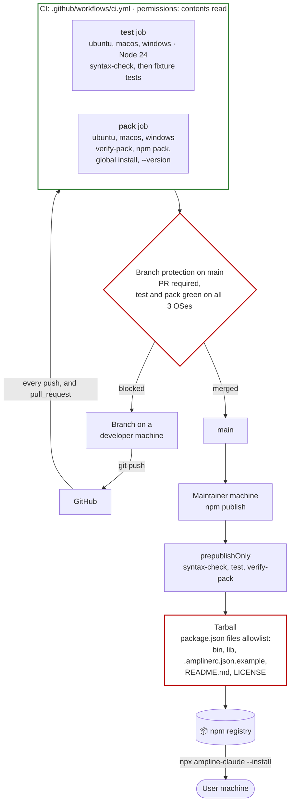
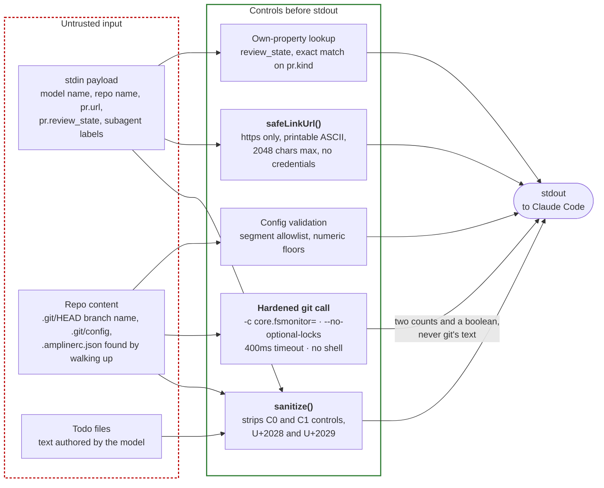

# Deployment and security

How code gets from a branch to a user's machine, and where the trust boundaries sit once it
runs. ampline-claude has no server, so "deployment" means a package on npm. The realistic risks
are a broken or tampered tarball, a hostile repo or payload that reaches the terminal, and
anything that could make a statusline read a secret or reach the network. The full policy is in
[`../SECURITY.md`](../SECURITY.md). This shows the mechanism behind it.

## Branch to user

**CI is a merge gate, not a deploy.** No workflow publishes anything. Publishing is a manual
`npm publish` from the maintainer's machine, and `prepublishOnly` runs the same syntax check,
fixture tests, and tarball check first. Branch protection itself is a GitHub repository
setting, so it is not visible in the repo files. The diagram shows it as configured.

**Why the `pack` job installs the real tarball.** A file-list check cannot see file contents.
v0.2.0 shipped with a CRLF shebang (`#!/usr/bin/env node` followed by a carriage return) that
broke `npx` on every non-Windows machine, and no check caught it because the fixture tests call
the binary through `node` and skip the shebang. Three things close that gap now.
`.gitattributes` forces LF line endings, `scripts/verify-pack.js` fails on any CR byte in the
entry file and checks the exact shebang line, and the `pack` job runs `npm pack`, installs the
tarball globally, and runs `ampline-claude --version` through the real shim. See D18 in
[`../DECISIONS.md`](../DECISIONS.md).

**What `scripts/verify-pack.js` asserts.** It runs `npm pack --dry-run --json` and fails unless
`bin/`, `lib/`, `README.md`, `LICENSE`, `.amplinerc.json.example`, and `package.json` are present
and `test/`, `scripts/`, `.github/`, any other `.md` file, and any implementation-plan file are
absent. `diagrams/` is not in the allowlist, so these files never ship.

**Actions are referenced by version tag** (`actions/checkout@v7`, `actions/setup-node@v7`), not by
commit SHA. The workflow uses no secrets and has read-only repository permissions, so a
compromised action would have no token to misuse beyond reading the repo.

## What runs on the user's machine

## The controls, and what each one stops

| Control | Where | Stops |
| --- | --- | --- |
| `sanitize()` | applied to branch name, repo name, directory name, todo text, subagent label and description, model name, and the config `separator` | Terminal escape sequences smuggled in through text the user did not write. A committed `.amplinerc.json` loads automatically, so an unsanitized `separator` was a live OSC 8 injection (D19) |
| `safeLinkUrl()` in `lib/segments/pr.js` | `pr.url` before it goes inside an OSC 8 hyperlink | A BEL or ESC in a URL ending the link early and injecting more. Only a plain `https` URL with no credentials becomes a link, and the parsed `href` is emitted, not the raw string (D38) |
| `Object.hasOwn` lookup, exact `pr.kind` match | `review_state` color table, `!N` versus `#N` label | `review_state: "constructor"` printing function source. The `kind` string itself is never interpolated (D38) |
| `-c core.fsmonitor=` | the one `execFileSync('git', ...)` call | A repo's `.git/config` naming a hook command that git would run on every render (D20) |
| `--no-optional-locks` | the same call | Taking the index lock every 30 seconds and contending with the user's own git commands |
| 400ms timeout, argv array, stderr ignored | the same call | A slow or hung `git` blocking a render. There is no shell, so no argument is parsed as a command line |
| Config validation | `lib/config.js` | A config file naming unknown segments or nonsense numbers. Config is data only, with no path or command keys |
| `stripAnsi()` | width math in `lib/layout.js`, and the whole line when `config.color` is `false` | Wrong wrapping from escape bytes, and any escape (including a link) when color is off. It is not the injection defense on the default path, `sanitize()` is |
| `NO_COLOR` | `lib/colors.js`, and `lib/segments/pr.js` for links | Color and hyperlink escapes when the user asked for plain text |

## Absent by design

| Rule | What it means in the code |
| --- | --- |
| No network | No HTTP, socket, or DNS module is required anywhere in `bin/` or `lib/`. See [`c4-context.md`](c4-context.md) |
| No credential reads | The only environment variables the code reads directly are `NO_COLOR`, `CLAUDE_CONFIG_DIR`, and `COLUMNS`. `os.homedir()` also resolves the home directory from `HOME` or `USERPROFILE` |
| No runtime dependencies | `package.json` has no `dependencies` field, so `npx` fetches one package and there is no transitive supply chain |
| Writes stay under the Claude config directory | `~/.claude` or the `CLAUDE_CONFIG_DIR` override holds `settings.json` and its backups, the installed runtime, and the cache. See [`install-flow.md`](install-flow.md) |
| stdout is the product, stderr is debug only | The one exception is a one-line install hint on genuinely empty stdin, which never happens during a real render |

## Known gap

The `git` call is the only one with a real timeout. The synchronous file reads in `lib/cache.js`
and `lib/segments/task.js` have no ceiling, so a network-mounted `~/.claude` could stall a
render for as long as that I/O takes. [`../CLAUDE.md`](../CLAUDE.md) records this as unaddressed.
See [`cache-tiers.md`](cache-tiers.md) for where those reads happen.

## Reporting

Only the latest published version is supported. Vulnerabilities go through GitHub's private
vulnerability reporting, never a public issue. In scope: reading a credential, making a network
call, writing outside the Claude config directory, executing unintended code, and injecting
terminal control sequences from untrusted input. Problems in Claude Code, `git`, or the `gh`
CLI are out of scope. See [`../SECURITY.md`](../SECURITY.md).

---
_Last updated: 2026-10-07 · reflects v0.6.0_
