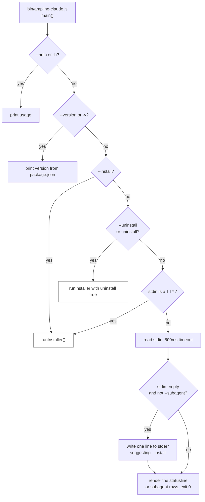
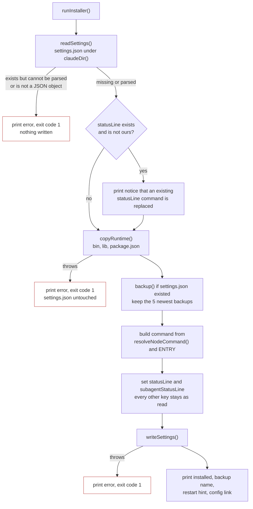
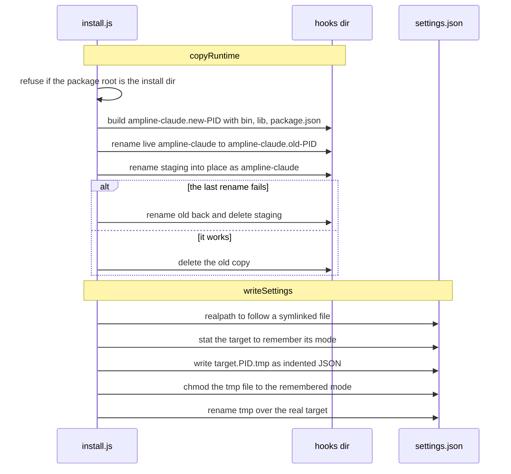
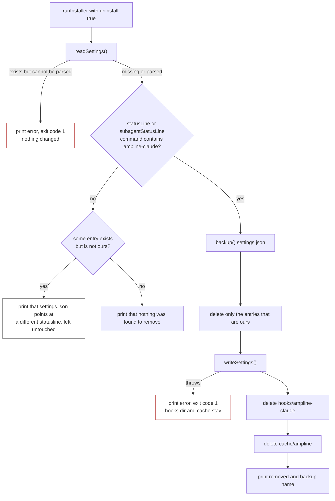

# Flowchart: install and uninstall

What `npx ampline-claude --install` and `npx ampline-claude uninstall` do to the machine, and how
the entry point decides to run the installer at all. The installer is the one module that edits a
file the user owns, so most of the steps below exist to avoid damaging it. For where the installed
copy runs, see [`render-sequence.md`](render-sequence.md). For the trust boundaries, see
[`deployment-security.md`](deployment-security.md).

## How the entry point picks a path

Flags are checked before the TTY test, so `--install` and `uninstall` work from scripts and CI.
A bare `npx ampline-claude` installs only when stdin is a TTY. Claude Code runs the same entry
point with piped stdin on every render, so a non-TTY invocation cannot be told apart from a real
render. If stdin turns out to be empty, the entry point still runs the render path and exits 0,
and it writes the one-line hint to stderr only. It never touches stdout. This is `DECISIONS.md`
D17, and D9 explains why there is no interactive menu. The `if (require.main === module)` guard
at the bottom keeps a plain `require('ampline-claude')` from starting an install.

## Install

**What gets written.** `statusLine` is `{ type: "command", command, padding: 0, refreshInterval: 30 }`
and `subagentStatusLine` is `{ type: "command", command: "<same command> --subagent" }`. The
command is the node binary in quotes followed by the quoted path to
`<claudeDir>/hooks/ampline-claude/bin/ampline-claude.js`. Both paths use forward slashes, which
Windows accepts and which avoids escaping backslashes in JSON. `resolveNodeCommand()` uses
`process.execPath` when it is absolute and exists, and falls back to a bare `node` otherwise
(`DECISIONS.md` D27). `refreshInterval: 30` is there because the reset countdown and git state go
stale while Claude Code is idle (`DECISIONS.md` D33).

**Foreign entries.** An existing `statusLine` that does not mention `ampline-claude` is replaced
after the notice prints, with the old command shown. A foreign `subagentStatusLine` is replaced
without a notice. Everything else in `settings.json`, such as hooks, MCP servers and `env`, is
kept because the merge only assigns those two keys.

**Where it lives.** `CLAUDE_CONFIG_DIR` is honored through `lib/claudeDir.js`, which returns the
override resolved to an absolute path, or `~/.claude` when it is unset. The settings file, the
hooks directory, the backups and the cache directory all hang off that one value, so the
installer cannot report success while writing a `settings.json` that Claude Code never reads
(`DECISIONS.md` D24). The value is computed when `install.js` loads.

## The two risky file operations

**The runtime copy is staged, then swapped.** The live install is never deleted before its
replacement exists. If the final rename fails, the previous directory is renamed back and the
error is rethrown, so a failed update leaves the old version in place (`DECISIONS.md` D13). The
installer also refuses to run from inside the installed copy, since removing a directory you are
running from fails with EBUSY on Windows. `package.json` is copied because `--version` reads it.
The result is that Claude Code runs a stable local copy, not a fresh `npx` download on every
render.

**The settings write goes through symlinks and keeps permissions.** Dotfiles managers often
symlink `settings.json`, and a plain rename would replace the link with a regular file. Resolving
the real path first means the link survives. The original mode is copied onto the tmp file before
the rename, so a deliberate `chmod 600` on a file that can hold API keys is not lost
(`DECISIONS.md` D28). Windows has no POSIX permission bits, so that part is verified only on POSIX
machines. If `writeSettings` throws, the tmp file is not cleaned up by that function and the
runtime copy has already happened, but `settings.json` itself is unchanged.

**Order matters.** The runtime is copied before the backup and the settings write, so a copy
failure never touches `settings.json`. Backups are named `settings.json.backup.<timestamp>` and
sit next to the settings file. Only the newest five are kept.

## Uninstall

**Ownership is a substring test.** An entry counts as ours if its `command` is a string that
contains `ampline-claude`. The refusal in the README ("points at a different statusline, uninstall
refuses to touch it") applies when neither entry is ours. If one entry is ours and the other is
foreign, uninstall removes the one that is ours and leaves the foreign one in place.

**The backup comes after the decision.** `backup()` runs only once uninstall has decided to change
something, so a refused uninstall leaves no stray backup file. The hooks directory and the cache
directory are deleted only after `settings.json` has been written successfully, so a failed write
cannot leave Claude Code pointing at a runtime that no longer exists. If `settings.json` does not
exist at all, uninstall reports nothing to remove and does not delete the hooks directory or the
cache. Old `settings.json.backup.*` files are left alone.

---
_Last updated: 2026-10-07 · reflects v0.6.0_
