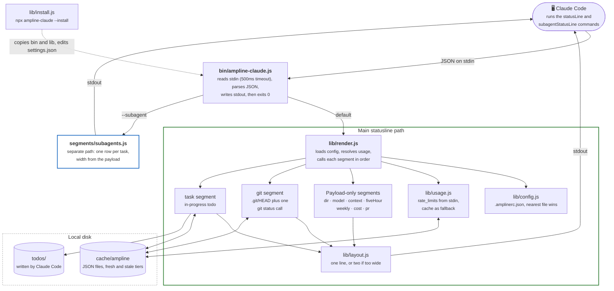

# Overview: the whole system in one diagram

Start here. ampline-claude is a short-lived Node process. Claude Code starts it, pipes a JSON
payload to its stdin, and reads one or two lines of colored text back from stdout. Nothing runs
in between renders. Every box below is expanded in its own diagram (see the table at the
bottom).

**The one thing to take away:** every render is a fresh process that gets everything it needs
from the payload on stdin. Disk is only a shortcut. The cache holds the last good rate-limit
numbers and the results of the two slow lookups (the git call and the todo read), and it can be
empty or missing and the render still succeeds, with a segment left out at worst. There is no network
call anywhere, so the cost of a render is one process start plus at most one `git status`.
See [`c4-context.md`](c4-context.md) for what that rules out.

**The subagent path is a separate invocation, not a branch of the main one.** Claude Code runs
the installed command with `--subagent` and a different payload shape (a `tasks`
array and a `columns` number). It never calls config, usage, or layout. See
[`c4-container.md`](c4-container.md) for the module-level dependencies and
[`../CLAUDE.md`](../CLAUDE.md) for the payload details.

**The installed copy is what runs.** The installer copies `bin/` and `lib/` to
`~/.claude/hooks/ampline-claude/` and points `settings.json` at that copy, so Claude Code never
runs code out of the npm cache. See [`install-flow.md`](install-flow.md).

## Go deeper

| Question | Diagram |
| --- | --- |
| Who and what does ampline-claude sit among, and what does it never do? | [`c4-context.md`](c4-context.md) |
| What are the internal modules and how do they depend on each other? | [`c4-container.md`](c4-container.md) |
| What happens, step by step, from stdin payload to stdout line? | [`render-sequence.md`](render-sequence.md) |
| How is a model and effort level turned into a color? | [`color-wheel.md`](color-wheel.md) |
| How does a `pr` payload become `#N` or `!N` and a safe link? | [`pr-mr-segment.md`](pr-mr-segment.md) |
| How do the fresh and stale cache tiers behave? | [`cache-tiers.md`](cache-tiers.md) |
| What does `--install` do, and how does it avoid damaging `settings.json`? | [`install-flow.md`](install-flow.md) |
| How does code reach users, and where are the trust boundaries? | [`deployment-security.md`](deployment-security.md) |

---
_Last updated: 2026-10-07 · reflects v0.6.0_
