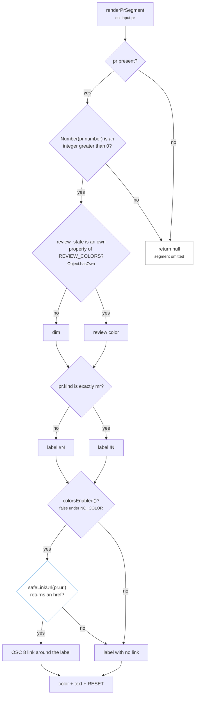
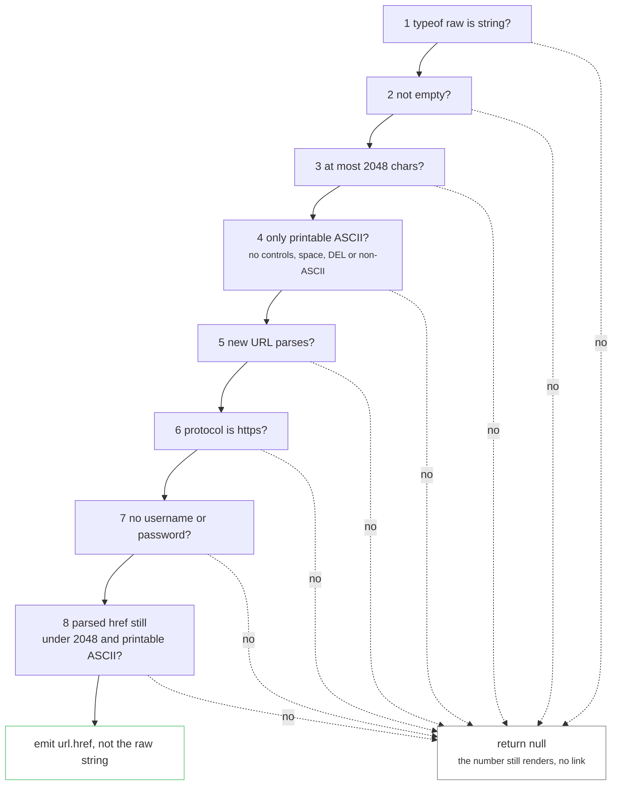

# Flowchart: the PR and MR segment

How `renderPrSegment` in `lib/segments/pr.js` turns the `pr` object from the Claude Code payload
into `#12` or `!42`, which color it gets, and when the number becomes a clickable link. The number
is the product. The link is optional and has to earn its place.

**The whole body is inside `try/catch`**, so any unexpected shape also ends in `null`. The number
check exists because `Number(null)`, `Number('')`, `Number(false)` and `Number([])` all coerce to
0 and would otherwise render a phantom `#0` (D22).

**`kind` picks the sigil and is never printed.** Only the exact string `mr` gives GitLab's `!N`.
Anything else, including a missing field or an escape sequence stuffed into `kind`, gives `#N`.
The URL is never inspected to guess the host, because `kind` arrived in the same Claude Code
release as GitLab support, so absent reliably means GitHub.

## The link check

`safeLinkUrl` exists because `pr.url` is a foreign string that ends up inside an OSC 8 escape
sequence. A BEL or ESC slipping through would let the payload write its own terminal commands.
The checks run in this order, and the first failure stops the chain.

Steps 1 to 3 are one guard line in the code and steps 6 and 7 are one condition, but the order
is the same. Every failure has the same fallback, which is the colored label with no link. There
is no host allowlist, because self-managed GitLab and GitHub Enterprise hosts are arbitrary. The
`NO_COLOR` case is handled before `safeLinkUrl` is called, and a config of `"color": false` removes
the link afterward because `stripAnsi` also strips OSC sequences. `test/run.js` `runPrTests`
covers the hostile cases: `javascript:` and `file:` schemes, plain `http`, embedded credentials,
BEL plus an OSC title breakout, an ESC clear-screen, a space, a newline, a non-ASCII character,
U+2028, a URL over 2048 characters, an empty string, a non-string and a non-URL.

## Review state colors

| `review_state` | Color |
|---|---|
| `approved` | green `#60C878` |
| `pending` | yellow `#F5C43D` |
| `changes_requested` | red `#E8433D` |
| `draft` | dim |
| absent or anything else | dim |

The lookup is an own-property check because `review_state` is a foreign string. With a bare
`REVIEW_COLORS[pr.review_state]`, a value of `constructor` resolved to `Object.prototype.constructor`
and printed function source into the statusline. The tests cover `constructor`, `toString`,
`__proto__` and `hasOwnProperty`.

## What Claude Code must provide

ampline never runs `gh` or `glab` and never makes a network call. The `pr` object arrives on stdin
already filled in by Claude Code. For GitHub, Claude Code populates it through the `gh` CLI or a
`GH_TOKEN` or `GITHUB_TOKEN` token. For GitLab, since Claude Code v2.1.234 and with `glab`
authenticated, it describes the merge request and sets `pr.kind` to `mr`. If the field is missing,
the segment is simply omitted.

**Why it works this way:** the segment stays host-agnostic and has no credentials to leak. The
GitHub path was verified against a real payload in D12. D38 records the `!N` label, the validated
hyperlink and the `Object.hasOwn` fix. The GitLab payload shape comes from Claude Code's published
docs and has not been confirmed against a live GitLab session, which D38 states. See
[`../DECISIONS.md`](../DECISIONS.md) and the rules in [`../CLAUDE.md`](../CLAUDE.md). For where this
segment sits in a render see [`render-sequence.md`](render-sequence.md), and for the deployment
and trust boundary see [`deployment-security.md`](deployment-security.md).

---
_Last updated: 2026-10-07 · reflects v0.6.0_
