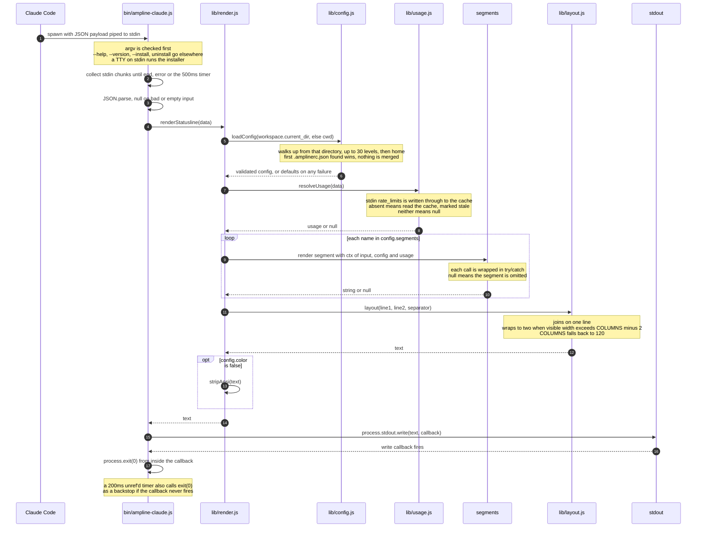
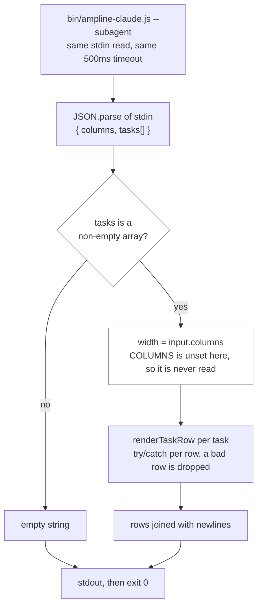

# Sequence diagram: one statusline render

What happens between Claude Code spawning `bin/ampline-claude.js` and a line of text appearing in
the terminal. The important part is the failure story: every step either produces output or
degrades to less output, and the process exits 0 in all cases.

**Routing happens before any stdin is read.** `main()` checks `--help` or `-h`, then `--version`
or `-v`, then `--install`, then `--uninstall` or `uninstall`. Only then does it look at
`--subagent` and at `process.stdin.isTTY`. A TTY means a human ran the bare command, so the
installer runs. Claude Code always pipes a payload, so a real render never takes that branch.
If stdin is genuinely empty and `--subagent` was not passed, one install hint goes to stderr
and nothing changes on stdout. See [`install-flow.md`](install-flow.md) for the installer side.

**The line is split by config, then by width.** `line2From` (default `fiveHour`) marks the first
segment that belongs on line 2. `layout()` still joins everything on one line when it fits.
It only emits a newline when the combined visible width, measured after `stripAnsi`, is more than
`COLUMNS - 2`. Segment ownership is covered in [`overview.md`](overview.md) and
[`c4-container.md`](c4-container.md).

## The subagent path

`subagentStatusLine` runs the same binary with `--subagent`, but the payload is a different
shape and none of the config or layout code is involved.

Each row is built from `task.label || task.description || 'agent'` (sanitized), a status color
for the arrow, the model collapsed to a family label, and an optional token count. The name
budget comes from `columns`. There is no `name` field, and `task.type` is always `"local_agent"`,
so it is never shown. `task.effort` is usually absent or numeric, and `normalizeEffortLevel`
returns `null` for both, which is why the row color falls back to the family. See
[`color-wheel.md`](color-wheel.md).

**Why the render is shaped this way:** a statusline that fails is worse than one that is blank,
so the contract in [`../CLAUDE.md`](../CLAUDE.md) is "something rendered and exit 0". Each segment
returns `null` rather than throwing, `renderStatusline` wraps every segment call anyway, and the
entry point wraps the whole render, falling back to an empty string. The write-then-exit order
exists because stdout to a pipe is asynchronous on Windows, so exiting right after `write()`
truncates the output. The one real timeout in the system is on the `git status` call, and the
stdin timer only guards a stream that never closes. The empty-stdin hint is D17 in
[`../DECISIONS.md`](../DECISIONS.md), the `COLUMNS` fallback is D26, and the subagent payload
facts are D2 to D5. The synchronous filesystem reads that have no ceiling are listed as a known
gap in CLAUDE.md.

---
_Last updated: 2026-10-07 · reflects v0.6.0_
